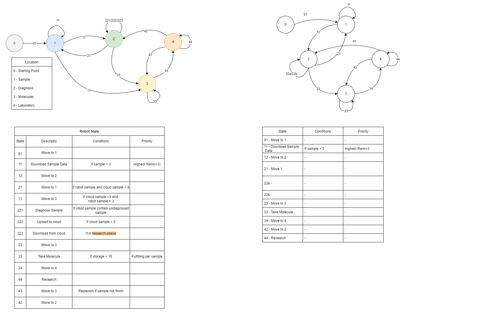

[![Game][game-shield]][game-url]
[![Profile][profile-shield]][profile-url]

<!-- PROJECT LOGO -->
 

<h3 align="center">Code4Life Solution Project</h3>
    This is personal project to record the game progress. Just for my own fun =)
  
  

     
    <a href="https://github.com/CodExorcist/Code4Life/tree/main/source"><strong>Explore »</strong></a>
     
     
  

<!-- TABLE OF CONTENTS -->

  
Table of Contents

  <ol>
    <li>
      <a href="#about-the-project">About The Project</a>
    </li>
    <li>
        <a href="#league">League</a>
        <ul>
            <li><a href="#wood-league">Wood League</li>
        </ul>
    </li>
  </ol>

<!-- ABOUT THE PROJECT -->
## About The Project

[![Game Screen Shot][game-screenshot]](https://www.codingame.com/ide/puzzle/code4life)

The main purpose for this repository to share on my idea to play the Code4Life game.

(<a href="#readme-top">back to top</a>)

<!-- League -->
## League

The game difficulty will be increase as the progress.

### Wood 2 League

The game start with this difficulty, with the conditions given, the state diagram for robot complete the work as above.

### Wood 1 League

After Wood 2 League complete, the game proceed to Wood 1 League difficulty, the state diagram design for the bot.

<!-- MARKDOWN LINKS & IMAGES -->
<!-- https://www.markdownguide.org/basic-syntax/#reference-style-links -->
[game-shield]: https://img.shields.io/badge/GAME-codingame-yellow
[game-url]: https://www.codingame.com/ide/puzzle/code4life
[profile-shield]: https://img.shields.io/badge/PROFILE-profile-blueviolet
[profile-url]: https://www.codingame.com/profile/4842990ea3d4215bd2f3b15da061690f7805392
[game-screenshot]: images/Code4Life_Sample.gif
